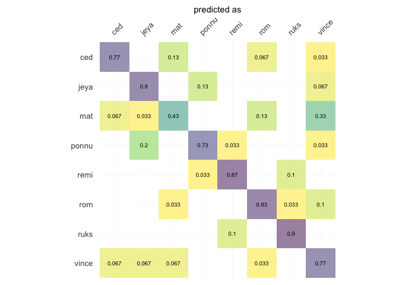

<!--README.md is generated from README.Rmd. Please edit that file -->

# Momocs <a href="http://momx.github.io/Momocs/"></a>

<!-- badges: start -->

[](https://lifecycle.r-lib.org/articles/stages.html#superseded)
[](https://CRAN.R-project.org/package=Momocs)
<!-- badges: end -->

### News

- Momocs is now retiring and, one day, will no longer be supported in
  favour of Momocs2 and the entire MomX ecosystem. (as of Jan 26)
- I’m available for consulting, training and collaboration, worldwide.
- Momocs is back on CRAN and no longer relies on the retired `rgeos`
  dependency
- The tutorial/introduction is back! Download it
  [there](https://github.com/MomX/Momocs/releases/download/v1.4.0/Momocs_intro.html)\*\*

### Installation

The last released version can be installed from
[CRAN](https://CRAN.R-project.org/package=Momocs) with:

``` r
install.packages("Momocs")
```

But I recommend using (and only support) the development version from
GitHub with:

``` r
# install.packages("devtools")
devtools::install_github("MomX/Momocs")
```

<!--
## Features
__Matrices of xy-coordinates__
* ~100 generic tools like centering, scaling, rotating, calculating area, perimeter, etc. Full list with `apropos("coo_")`
* generic plotters: `coo_plot` and `g` (work in progress)
&#10;__Data acquisition + Babel__
&#10;* Outline extraction from black mask/silhouettes `.jpgs`
* Landmark definition on outlines (`def_ldk` or via [StereoMorph](https://github.com/aaronolsen/StereoMorph))
* Open curves digitization with bezier curves (via [StereoMorph](https://github.com/aaronolsen/StereoMorph))
* Import/Export from/to `.nts`, `.tps`, `PAST`, `.txt`, etc.
&#10;__Outline analysis__
&#10;* Elliptical Fourier analysis (`efourier`)
* Radii variation (`rfourier`)
* Radii variation - curvilinear abscissa (`sfourier`)
* Tangent Angle Fourier analysis (`tfourier`)
&#10;__Open-outlines__
&#10;* Natural (raw) polynomials (`npoly`)
* Orthogonal (Legendre) polynomials (`opoly`)
* Discrete Cosinus Transform (`dfourier`)
* `bezier` core functions
&#10;__Configuration of landmarks__
&#10;* Full Generalized Procrustes Adjustment (`fgProcrustes`)
* Sliding semi-landmarks (`fgsProcrustes`)
&#10;__Traditional morphometrics and global shape descriptors__
&#10;* Facilities for multivariate analysis (see `flowers`)
* A long list of shape scalars (eg. `coo_eccentricity`, `coo_rectilinearity`, etc.)
&#10;__Data handling__
&#10;* Easy data manipulation with `filter`, `select`, `slice`, `mutate` and other verbs ala [dplyr](https://github.com/hadley/dplyr/)
* New verbs useful for morphometrics such as `combine` and `chop`, to handle several 2D views
* Permutation methods to resample data (`perm`, `breed`)
&#10;__Multivariate analysis__
&#10;* Mean shape (groupwise) calculations (`mshapes`)
* Principal component analysis (`PCA`)
* Multivariate analysis of variance (`MANOVA` + pairwise testing `MANOVA_PW`)
* Linear discriminant analysis and screening (`LDA`)
* Hierarchical clustering (`CLUST`)
* K-means (`KMEANS`)
&#10;__Graphical methods__
&#10;* Family pictures and quick inspection of whole datasets (`stack` and `panel`)
* Some `ggplot2` plots, when useful (and convet Momocs' objects into `data.frames it with `as_df`)
* Morphological spaces for PCA
* Thin plate splines and variation around deformation grids
&#10;
__Misc__
&#10;* Datasets for all types of data (`apodemus`, `bot`, `chaff`, `charring`, `flower`,  `hearts`, `molars`, `mosquito`, `mouse`, `oak`, `olea`, `shapes`, `trilo`, `wings`)
* [Shiny](http://shiny.rstudio.com/) demonstrators/helpers. See [Momecs](https://github.com/vbonhomme/Momecs/)
* [Online documentation](http://vbonhomme.github.io/Momocs/)
-->

### Example

This is a basic example of a complete analysis doing: inspection,
normalization of raw outlines, elliptical Fourier transforms,
dimmensionality reduction and classification, using a single line.

``` r
library(Momocs)
```

``` r
devtools::load_all()
#> ℹ Loading Momocs
#> Registered S3 method overwritten by 'vegan':
#>   method     from      
#>   rev.hclust dendextend
```

``` r
hearts %T>%                    # A toy dataset
  stack() %>%                  # Take a family picture of raw outlines
  fgProcrustes() %>%           # Full generalized Procrustes alignment
  coo_slide(ldk = 2) %T>%      # Redefine a robust 1st point between the cheeks
  stack() %>%                  # Another picture of aligned outlines
  efourier(6, norm=FALSE) %>%  # Elliptical Fourier Transforms
  PCA() %T>%                   # Principal Component Analysis
  plot_PCA(~aut) %>%           # A PC1:2 plot
  LDA(~aut) %>%                # Linear Discriminant Analysis
  plot_CV()                    # And the confusion matrix after leave one out cross validation
```

<!-- --><!-- --><!-- -->

    #> Warning: The `<scale>` argument of `guides()` cannot be `FALSE`. Use "none" instead as
    #> of ggplot2 3.3.4.
    #> ℹ The deprecated feature was likely used in the Momocs package.
    #>   Please report the issue at <https://github.com/MomX/Momocs/issues>.
    #> This warning is displayed once every 8 hours.
    #> Call `lifecycle::last_lifecycle_warnings()` to see where this warning was
    #> generated.

<!-- -->
