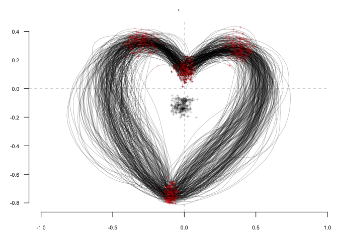
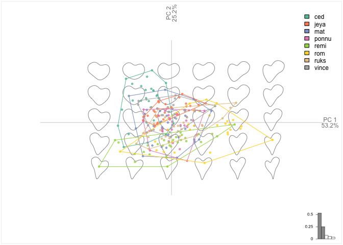

<!--README.md is generated from README.Rmd. Please edit that file -->
Momocs
------

*Part of [MomX](https://momx.github.io/MomX/)*

<!--Badges -->
[](https://www.tidyverse.org/lifecycle/#maturing) [](https://travis-ci.org/MomX/Momocs) [](https://codecov.io/github/MomX/Momocs?branch=master) [](http://cran.r-project.org/package=Momocs)  

The goal of Momocs is to provide a complete, convenient, reproducible and open-source toolkit for 2D morphometrics.

It includes most common 2D morphometrics approaches on outlines, open outlines, configurations of landmarks, traditional morphometrics, and facilities for data preparation, manipulation and visualization with a consistent grammar throughout.

It allows reproducible, pipeable, complex morphometric analyses and other morphometrics approaches should be easy to plug in, or develop from, on top of this canvas.

Its core functions are borrowed from hinges on the core functions developed in the must-have book *[Morphometrics with R](http://www.springer.com/statistics/life+sciences,+medicine+%26+health/book/978-0-387-77789-4)* by [Julien Claude](http://www.isem.univ-montp2.fr/recherche/equipes/biologie-du-developpement-et-evolution/personnel/claude-julien/) (2008).

-   **Check** the online doc and the tutorials [there](http://momx.github.io/Momocs/)
-   **You're welcome to** implement ideas, propose new ones, review the code, the helpfiles or the vignettes, report bugs, ask for help and propose to collaborate with me: [here on GitHub](https://github.com/MomX/Momocs/issues) or there: `bonhomme.vincent@gmail.com`.

### Installation

The last released version can be installed from [CRAN](https://CRAN.R-project.org/package=Momocs) with:

``` r
install.packages("Momocs")
```

But I recommend using the development version from GitHub with:

``` r
# install.packages("devtools")
devtools::install_github("MomX/Momocs")
```

<!--
## Features
__Matrices of xy-coordinates__
* ~100 generic tools like centering, scaling, rotating, calculating area, perimeter, etc. Full list with `apropos("coo_")`
* generic plotters: `coo_plot` and `g` (work in progress)

__Data acquisition + Babel__

* Outline extraction from black mask/silhouettes `.jpgs`
* Landmark definition on outlines (`def_ldk` or via [StereoMorph](https://github.com/aaronolsen/StereoMorph))
* Open curves digitization with bezier curves (via [StereoMorph](https://github.com/aaronolsen/StereoMorph))
* Import/Export from/to `.nts`, `.tps`, `PAST`, `.txt`, etc.

__Outline analysis__

* Elliptical Fourier analysis (`efourier`)
* Radii variation (`rfourier`)
* Radii variation - curvilinear abscissa (`sfourier`)
* Tangent Angle Fourier analysis (`tfourier`)

__Open-outlines__

* Natural (raw) polynomials (`npoly`)
* Orthogonal (Legendre) polynomials (`opoly`)
* Discrete Cosinus Transform (`dfourier`)
* `bezier` core functions

__Configuration of landmarks__

* Full Generalized Procrustes Adjustment (`fgProcrustes`)
* Sliding semi-landmarks (`fgsProcrustes`)

__Traditional morphometrics and global shape descriptors__

* Facilities for multivariate analysis (see `flowers`)
* A long list of shape scalars (eg. `coo_eccentricity`, `coo_rectilinearity`, etc.)

__Data handling__

* Easy data manipulation with `filter`, `select`, `slice`, `mutate` and other verbs ala [dplyr](https://github.com/hadley/dplyr/)
* New verbs useful for morphometrics such as `combine` and `chop`, to handle several 2D views
* Permutation methods to resample data (`perm`, `breed`)

__Multivariate analysis__

* Mean shape (groupwise) calculations (`mshapes`)
* Principal component analysis (`PCA`)
* Multivariate analysis of variance (`MANOVA` + pairwise testing `MANOVA_PW`)
* Linear discriminant analysis and screening (`LDA`)
* Hierarchical clustering (`CLUST`)
* K-means (`KMEANS`)

__Graphical methods__

* Family pictures and quick inspection of whole datasets (`stack` and `panel`)
* Some `ggplot2` plots, when useful (and convet Momocs' objects into `data.frames it with `as_df`)
* Morphological spaces for PCA
* Thin plate splines and variation around deformation grids


__Misc__

* Datasets for all types of data (`apodemus`, `bot`, `chaff`, `charring`, `flower`,  `hearts`, `molars`, `mosquito`, `mouse`, `oak`, `olea`, `shapes`, `trilo`, `wings`)
* [Shiny](http://shiny.rstudio.com/) demonstrators/helpers. See [Momecs](https://github.com/vbonhomme/Momecs/)
* [Online documentation](http://vbonhomme.github.io/Momocs/)
-->
### Example

This is a basic example of a complete analysis doing: inspection, normalization of raw outlines, elliptical Fourier transforms, dimmensionality reduction and classification, using a single line.

``` r
library(Momocs)
hearts %T>%                    # a built in dataset
  stack() %>%                  # family picture on raw outlines
  fgProcrustes() %T>%          # full generalized Procrustes alignment
  coo_slide(ldk=1) %T>%        # redefine an homologous 1st point
  stack() %>%                  # another family picture after fgProcrustes
  efourier(6, norm=FALSE) %>%  # elliptical Fourier transforms
  PCA() %T>% plot(~aut) %>%    # a PCA and a PC1:2 plot
  LDA(~aut) %>% plot_CV()      # an LDA and confusion matrix
```


