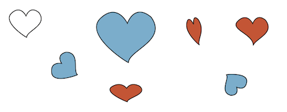

# About morphometrics
The link, if there were one, between the form and the function of objects, living or inert, has been one of the most enduring questions in the realm of science. In many situations, analysing the shape variation among objects can bring deep insights into their functioning and to the underlying mechanism leading to their variation in shape. 

Morphometrics aims at analyzing the variation and covariation of the *size* and *shape* of objects, defining altogether their form. Shape and form might be confusing words, used as synonyms  in many languages. Hereafter, we will use the definition of shape proposed by Kendall (1989) and Small (1996) that it is:

> "the total of all information invariant under translation, rotation, and isotropic rescaling''.

In other words, What remains if we draw an heart, and then rotate the page, or change its size uniformly, or move the page about on the desk, is the shape of the heart (see Figure below). Shape by essence is better described in three dimensions, but here, only two dimensional shape will be considered, \textit{e.g.}, three-dimensional objects will be viewed from one side and considered as represented by their projections on a plane.

******


**What is the shape?** Blue hearts have the same *shape* as the white one: we can obtain them by translating and/or rotating and/or rescaling the white object. Red hearts all have different shapes.

******

# About Momocs
Momocs, which names stands for **mo**dern **mo**rphometri**cs** aims at provinding a comprehensive environment for shape analysis in R.

Momocs started with the seminal book by Julien Claude, *Morphometrics with R* that provided, for the first time, an exhaustive list of function along with a very didactical approach. Then Sandrine Picq, as part of her PhD at the UMR CBAE in Montpellier, France, wrapped some of these functions to analyse the outlines of her grapevine seeds. After my PhD, I finally had the opportunity to start morphometrics while I was doing a post-doc at the French Institute of Pondicherry in India, with Cédric Gaucherel. At that time, Momocs was only dedicated to outline analyses and has been released for the first time in May 2012. The associated paper has been published in [Journal of Statistical Software](http://www.jstatsoft.org/v56/i13/) but in the meantime Momocs grown, month after month, and mainly because of the great welcome it had among morphometricians *union* R-users.

More recently I started a new post-doc with Eleanor Stillman and Glynis Jones, at the University of Sheffield in March 2014, and decided to rewrite it completely to include open outlines, configuration of landmarks, global shape descriptors, etc. Primarily because we needed it to study plant remains on which we had the great chance combine all these approaches.

Our ultimate aim is to provide a very complete environment and toolkit for all morphometrics approaches, to bring them all in an open-source environment, easy to extend, improve and fine-tune. In brief, to focus more on science than on softwares.

# About these vignettes
Most of the useRs will probably not need to read all of these vignettes to use Momocs but they will grab the overall logic behind Momocs and be quickly free as birds. Altogether, they are intended for form a nice and complete tutorial.

For pure R beginners, the way will be a bit longer but I hope it's feasible though. And if you come to R, thanks to morphometrics, I consider that a great news!

This tutorial assumes that you have a basic knowledge of R. If that's not the case, tons of freely available sites, books, etc. on R can be easily found and you can start [there](http://cran.r-project.org/other-docs.html). Do not hesitate to use Graphics User Interface for R, such as the great [RStudio](https://www.rstudio.com/), particularly if you are a beginner and are not yet an R masochist working on console mode or whatever. RStudio is not perfect yet, but tends to.

The aim of this manual is to provide an overview of the package, mostly graphically, neither to bring an exhaustive description of the package nor of morphometrics. For a detailed literature of shape analysis and Momocs features, have a look to:

* *Morphometrics with R* a must have book by Julien Claude, one of the Momocs' author, published by Springer, in the great UseR! collection. Julien also included an introduction to R and a nice bibliography.
* the Momocs companion paper published in [JSS](http://www.jstatsoft.org/v56/i13/). So far Momocs dealt only with outline analysis.
* the R help (type `?Momocs` in R). If you need help on a specific topic, le'ts say `efourier`, you can try: `?efourier` and `example(efourier)`.

Finally, this manual itself is written using a combination of R and RMarkdown thanks to RStudio. And you can access its code source [there](https://github.com/vbonhomme).

# How to contribute
Momocs is open-source and does not belong to someone in particular; it relies on you to signal bugs, share ideas, methods, tutorials, talks, datasets, etc.

Momocs has a [GitHub](https://github.com/vbonhomme/Momocs/) repository that welcomes contributions:  otherwise you can send me an email at the adress below. And naturally, any contribution you will be properly credited.

# Install and load Momocs
Enough talking, let's do some morphometrics with Momocs! All the grey boxes below contain R code, most of the time with the results it produces, text and/or graphs. If you copy/paste it in your own R, it should work the same way as here.

### From CRAN
Momocs is available from the [CRAN](http://cran.r-project.org/web/packages/Momocs/index.html) and you can install it as any other packages typing :
```{r, eval=FALSE}
install.packages("Momocs")
```

Note that you have to install it once, but to load it (via `library`) once per new R session, unless you save the environment (maybe comfortable but does not force you to have reproducible scripts):
```{r, eval=FALSE}
library(Momocs)
```

### From GitHub
But, I highly recommend to install the very last version (updated ± daily), in particular because I'm completely rewriting Momocs these days, and the code presented here is based on this last version, not on the CRAN version. My code repository is on [GitHub](https://github.com/vbonhomme), and we can install it directly in the console, using the package `devtools`. Just type:

```{r, eval=FALSE}
library(devtools)
install_github("vbonhomme/Momocs")
library(Momocs)
```

# A quick example

Let's start with a quick analysis on one of the datasets bundled with Momocs. The `bot`tles dataset which includes 20 (randomly chosen) outlines of beer bottles, and 20 of whisky bottles. We are interested in: i) exploring the morphological diversity of these 40 bottles, and ii) in testing whether whisky and beer bottles differ in shape.

We will first load it, print it, then calculate some elliptical Fourier analysis on it. On the matrix of coefficients, we will calculate a Principal Component Analysis and plot it, then test using a Multivariate analysis of variance whether the beer bottles have different shapes than the whisly bottles.
```{r}
library(Momocs)
data(bot)
bot
```

This overview indicates that `bot` is a `Out` object, some outlines (x; y) coordinates, and also that we have one "classifier" in the `\$fac` slot, called "type" and that indicates whether the corresponding outline is a beer or a whisky bottle.
```{r}
panel(bot, names=TRUE, fac="type")
```

On these, bottles, let's apply an elliptical Fourier analysis with default settings. Most of the core function of Momocs have default settings but print a message when important decisions are made for you. Here, the number of harmonics chosen.
```{r}
bot.f <- eFourier(bot, nb.h=12)
```

And then a principal component analysis, using the \texttt{type} classifier to draw groups of beer and whisky bottles.
```{r}
bot.p <- PCA(bot.f)
plot(bot.p, "type")
```

Then, a multivariate analysis of variance on the matrix of coefficients (\texttt{bot.f}) to test if the shapes of the two groups differ.

```{r}
Manova(bot.f, "type")
```

So, whisky and beer bottles do not "significantly" differ in their shape.

### Contact me!
If you:
* struggle to "make it works"
* have a doubt on something
* found a bug
* would like to propose an idea but do not know how to code it
* would like to share some code
*etc.
please do not hesitate to contact me. Your remarks are precious and you will be treated accordingly ;-) 

> `bonhomme.vincent@gmail.com`

Also, if you would like to try morphometrics on your objects and feel that it would me more efficient/quick/pleasant to do it through a collaboration, drop me a line!

