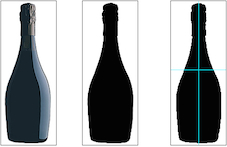

Most of the time, the longest and often more painful part of morphometrics is to acquire data, often pictures, and then convert it into lists $(x; y)$ coordinates.

In Momocs, you have the choice to use the built-in utilities or third-party softwares, and then import their data. For instance, [tpsDig](http://life.bio.sunysb.edu/ee/rohlf/software.html) is dedicated to morphometrics (particularly landmarks) and is widely used but unfortunately, only available for Windows users. 

[ImageJ](http://imagej.nih.gov/ij/) is a wide-spectrum image analysis software and you can extract outlines, identify landmarks, and then export them as $(x; y)$ coordinates (see `File > Save as > XY coordinates`). And as it relies on a Java virtual machine, it is cross-platform which is a good news for everyone and particularly Linux and Mac users.

In brief, built-in utilities implemented in Momocs are great for outlines, and poor for landmarks. So far, we focused at morphometrics and furthermore because R is not meant to handle images. Nevertheless, if you absolutely want to use R for landmark acquisition, have a look to `img.plot`, `img.plot0` and the R function `locator`.

I first describe below how to get ($x; y$) outline coordinates from `.jpg` images, and then morphometric data in general.

# Outline extraction from jpg
The following preliminaries steps can be achieved and partly automated using Adobe Photoshop, its open-source counterpart [GIMP](http://www.gimp.org/), ImageJ, and most of image manipulation softwares. These operations will not be exhaustively detailed since you are probably familar to them and they can be easily googled.

### Prepare images
For closed and open outlines, using an image editor, prepare images so that you get a black mask on a white background of the shape to be analysed. Pen tool and/or magic wand can be used to achieve this, as well as image adjustments such as contrast, levels, etc. When possible, align images using some reference points (or the global shape) so that all the images are roughly aligned in the same position. It is a good practice to conserve for each image a copy of the raw picture and the file produced by the image software.

### Center shapes
Ideally - and it is always possible- the center of the image should be within the shape to be analysed as illustrated in the Figure below. In case of complex concave shapes, you can use the rulers in the image software to place the shape to be analysed in the center of the image.

The Conte (see `?import.Conte`) algorithm extracts the image outline through an iterative process that is initialized at the image center. If it does not find a black pixel at center of the image, a `locator(1)` can be called and asks you to click a point within the shape, or another random point is selected.

Images should be saved as `.jpg` with no or a reasonable level of compression. 8-bit mode and gre-levels are preferred and will be faster. Monochrome (containing only two pixel values : 0 & 1 for black and white) are even better, but a threshold is applied anyway.

Size does not really matter but, the smaller the files, the faster the outline extraction but the lower the number of points. 100 ko files, should bring hundreds of outlines points, which is usually more than enough.

All `.jpg` images have to be saved in a folder. It is a (so) good and (so) time-saving practice to define a consistent naming rule such `name\textunderscore group1\textunderscore groupA.jpg`, since we can retrieve the grouping factors (the "classifiers" in ImageJ) using the Momocs' function `lf.structure`.

The `import.jpg` function (see `?import.jpg`), is your friend now. It works with a list of paths that can be grabbed with the R function `list.files`. Do not forget to ask for full names.

```{r, eval=FALSE}
lf <- list.files("~/Desktop/jpgs", full.names=TRUE)
coordinates <- import.jpg(lf)
coordinates
# alternatively
coordinates <- import.jpg() # now select a file
```

Above, `coordinates <- import.jpg()` will invite you to choose interactively any `jpg` in the folder, and will extract all outlines. But it is less elegant, as your script will require an action to be executed.

********


**Illustration of image preparation** The initial image (left) is first cropped out (middle). Then a threshold is applied to produce only have black and white pixels (right). Black rectangles indicate the image dimensions and the blue rulers in the right image indicate that the image center is within the shape.`

********

These steps are straightforward for closed outlines. If you want open outlines from masks, this is a bit more tricky.  You may have to define landmarks, curves on your images, etc. We will see some of these approaches later.

After these steps, you just have to pass the list created to one of the class builders, below `Out`, because we took the example of closed outlines, but it might have be `Opn` for open outlines (e.g. curves), of `Ldk` for landmarks, etc. You will find some technical description of these classes in the corresponding helpfiles in R (e.g. `?Coo, ?Opn, ?Ldk`), and also below.

```{r, eval=FALSE}
anicename <- Out(coordinates) # for open outlines
```  

# From text files
If you work with ImageJ or any other software which saves $(x; y)$ coordinates as `.txt` files, the game is to obtain a list of matrices. If you want an example of this list, simply have a look to the `\$coo` slot in any of the Momocs' dataset.

```{r, eval=FALSE}
data(trilo)
head(trilo$coo)
str(trilo$coo)
```

Let's imagine you have a list of `.txt` files in the `"\textbackslash path"` folder which first lines are formatted this way.
```
x y
0 14
3 15
4.2 18
5.1 15
```

```{r, eval=FALSE}
lf <- list.files("/path", full.names=TRUE) # or /path/
coordinates <- import.txt(lf)
# alternatively, see above for .jpg
coordinates <- import.txt()
```

`import.txt` has a special argument: "`...`" to fed a `read.table` function within the loop that reads files along the list of files (`lf`) above, yet an "automatic" version described above for `import.jpg` is available). What you have to do is to try to import a single `.txt` file using the appropriate arguments in `read.table`. For instance, for the example below, it would be: `read.table("asinglefile.txt", sep=" ", dec=".", skip=1)`. Because, separators between coordinates is a single space, decimal mark is a dot, and because you have to skip the header line to access the data. Once it works on "`asinglefile.txt`", just pass the additional arguments to `import.txt`, e.g.: `import.txt(lf, sep=" ", dec=".", skip=1)` and you should obtain a list of matrices, to be passed to `Out`, `Opn`, etc. Have a look to `?read.table` and `?import.txt`.

# From other morphometrics formats
If you use `.tps` and/or `.nts` files, have a look to the functions tagued with "babel": `tps2Coo` and `nts2Coo`. If you use chain-coded data, you can have a look to `pix2chc` and `chc2pix`, and probably go straight to `chc2Out`. If you want to import `.nef` files, have a look to `nef2Coe`.

I'm not very familiar to other morphometric formats so if you have troubles importing your datasets, please contact me. These functions may poorly work since they have not been extensively tested. If it is the case or should you need something else here, please let me know.


