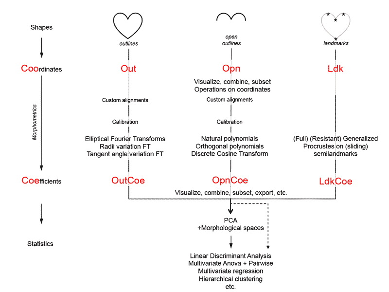

# About Momocs
Overall, long-term goals are :

* Gather all morphometrics in a single grammar
* Brige morphometrics softwares and analyses

But Momocs is a work in progress :

* It comes with no warranty
* Your help is welcome
* The very last version is on [GitHub](https://github.com/vbonhomme/Momocs), along with how to use it (you should).
* If you use it, please cite it: `citation("Momocs")`.

Also, Momocs makes the following assumptions:

* You have a basic knowledge of R (if you do not, tons of tutorials are freely available)
* You know what you want to do in statistics / morphometrics terms
* I welcome bug reports, suggestions, data, questions, collaborations requests, etc. **`bonhomme.vincent@gmail.com`**. Your help will be duly credited.


### Architecture

* A *shape* is an ordinate set (id varies from 1 to shape_length) of 2D (so far) coordinates
* `Coo`rdinates are shapes + (classifiers and/or covariates) + hypotheses + questions.
* `Coo` objects are turned into `Coe`fficients with appropriate morphometric methods, and on which to apply multivariate analyses.
* A lot of intermediate steps can, and usually *shoud*, be done.
* Graphically, this can be represented as:



### A quick `Out` example

Let's start with a quick analysis on one of the datasets bundled with Momocs. The `bot`tles dataset which includes 20 (randomly chosen) outlines of beer bottles, and 20 of whisky bottles. We are interested in: i) exploring the morphological diversity of these 40 bottles, and ii) in testing whether whisky and beer bottles differ in shape.

We will first load it, print it, then calculate some elliptical Fourier analysis on it. On the matrix of coefficients, we will calculate a Principal Component Analysis and plot it, then test using a Multivariate analysis of variance whether the beer bottles have different shapes than the whisly bottles.
```{r}
library(Momocs)
data(bot)
bot
```

This overview indicates that `bot` is a `Out` object, some outlines (x; y) coordinates, and also that we have one "classifier" in the `\$fac` slot, called "type" and that indicates whether the corresponding outline is a beer or a whisky bottle.
```{r}
panel(bot, names=TRUE, fac="type")
```

On these, bottles, let's apply an elliptical Fourier analysis with default settings. Most of the core function of Momocs have default settings but print a message when important decisions are made for you. Here, the number of harmonics chosen.
```{r}
bot.f <- efourier(bot, nb.h=12)
```

And then a principal component analysis, using the \texttt{type} classifier to draw groups of beer and whisky bottles.
```{r}
bot.p <- PCA(bot.f)
plot(bot.p, "type")
```

Then, a multivariate analysis of variance on the matrix of coefficients (\texttt{bot.f}) to test if the shapes of the two groups differ.

```{r}
MANOVA(bot.f, "type")
```

So, whisky and beer bottles do not "significantly" differ in their shape.


### Get some help

You can also have a look to Momocs' vignettes (work in progress) with : ```browseVignettes("Momocs")```

You can also have a look to Momocs' manual (````?Momocs````) or to individual help files (eg ````Out````).


If you:

* struggle to "make it works"
* have a doubt on something
* found a bug
* would like to propose an idea but do not know how to code it
* would like to share some code
* would like to collaborate
* etc.

feel free to drop me a line !
> `bonhomme.vincent@gmail.com`

### How to contribute
As everything R, Momocs is open-source and does not belong to someone in particular; it relies on you to signal bugs, share ideas, methods, tutorials, talks, datasets, etc.

Momocs has a [GitHub](https://github.com/vbonhomme/Momocs/) repository that welcomes contributions:  otherwise you can send me an email at the adress below. And naturally, any contribution you will be properly credited.

